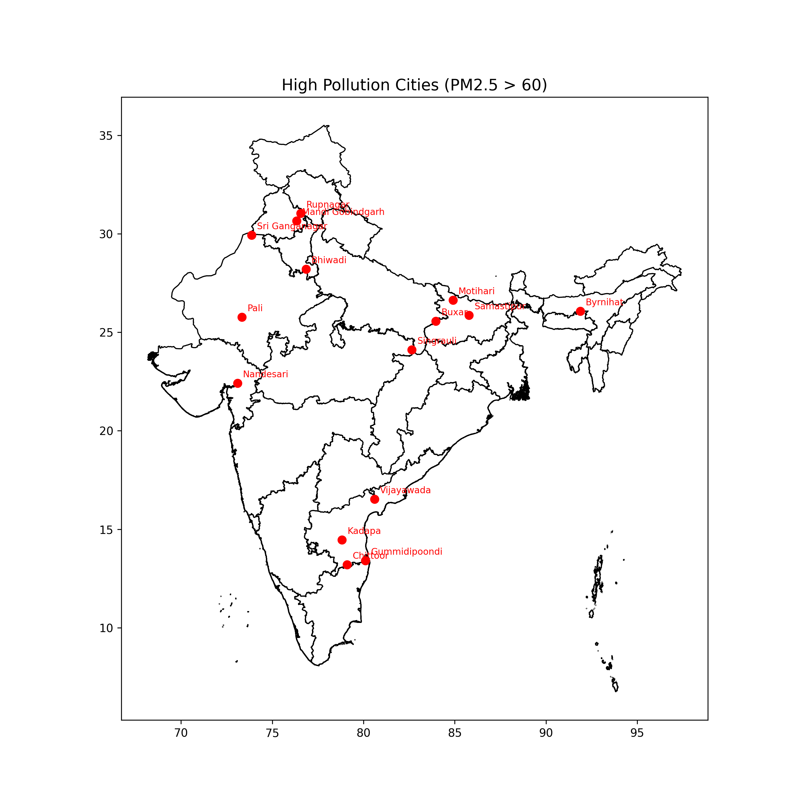
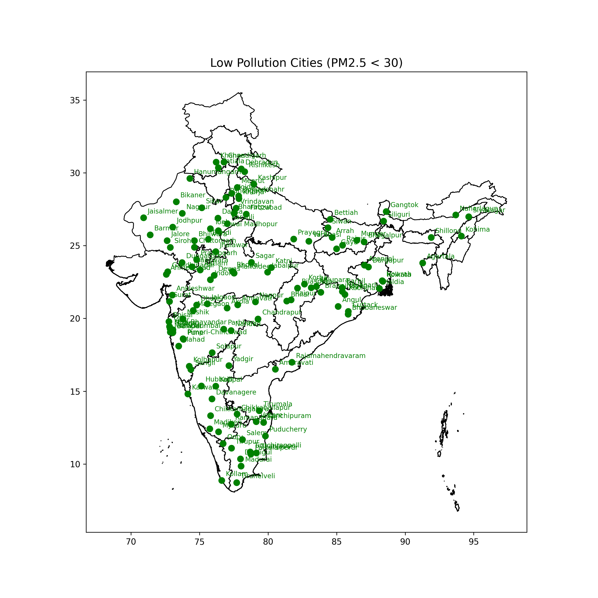
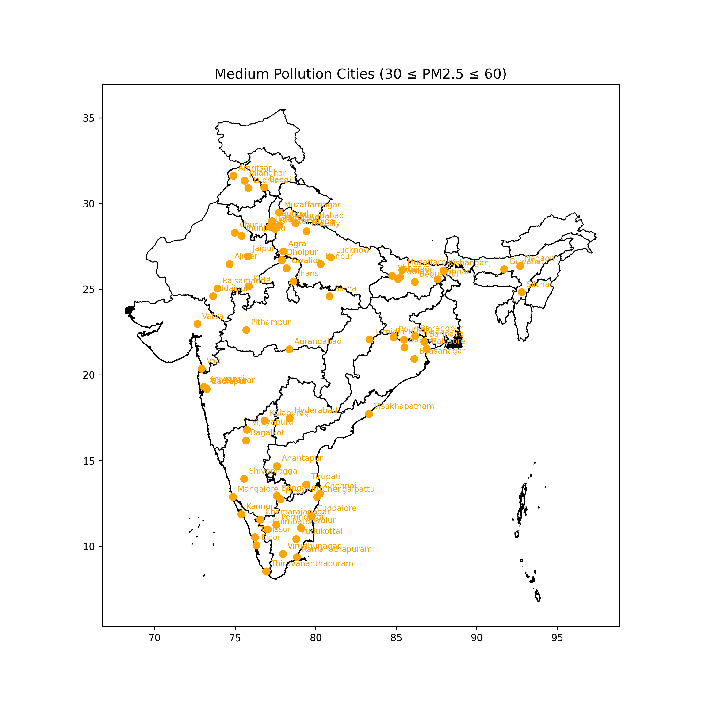

# Pollution-Map-of-Indian-Cities

---

  
  
  

---

This project is part of **Project-2** submitted by **Subhash Kumar Rana**  
for the **90-Day Internship Program** by **GUVI (HCL)**.

---

## 🔍 Project Description

---

This project uses GeoPandas along with shapefiles and pollution data to create a geospatial map that marks Indian cities and colors them based on their air pollution values. It helps visualize the severity of pollution in different regions.

---

## 🚀 Features

- ❌ Exit / Close Prog
- 📉 Most Polluted Cities
- 📈 Low Polluted Cities
- 🥧 Normal Polluted Cities
- 🌐 WebView / Apply Filter
- 📊 Polluted Cities India's
- 🧠 Project Info

---

## 🛠️ Technologies Used

- Python
- Pandas
- GeoPandas
- Matplotlib
- Jupyter Notebook / PyCharm (for development)

---

## 📁 Dataset
* Indin cities polution CSV Dataset:(21-08-2025 : 09:00:00)
  [`Source`](https://www.data.gov.in/resource/real-time-air-quality-index-various-locations)
* Indian Map Shape File:
  [`Source`](https://gadm.org/download_country.html)

---
## 📌 Project Files Overview

| File | Type | Description |
|------|------|-------------|
| [`main.py`](./main.py) | 🚀 Launcher | Main file | 
| [`services.py`](./services.py) | Core Logic | visualizations |
| [`Notebook.ipynb`](./notebook.ipynb) | 📓 Jupyter Notebook| Code & Visualization contains |
| [View My HTML Page](india_pollution_map_final.html) | Webpage | Visual Map and Filter |

---

## 🧠 About Me

**Subhash Kumar Rana**  
🎓 B.Sc. (Hons.) Computer Science & Data Analytics (Graduating 2026)  
📬 Email: subhash_2312res664@iitp.ac.in  
📞 Contact: +91 62997 42348  
🔗 LinkedIn / GitHub: _[https://github.com/subhash2312res664]_

I'm passionate about data, coding, and solving real-world problems with analytics.  
Feel free to connect for collaboration or project ideas!

---
